# Electric Windows Installation Guide - ED9 to EE8 Conversion

*Thursday, November 06, 2008 21:38*

## Introduction

Here follows a guide on how to replace the manual window operating mechanism of an ED9 with the electric mechanism of an EE8 (CRX VTEC). The sequence described here seems logical to me, but of course, it can be done in a different order.

**The official electrical diagram can be downloaded [here](https://www.decrxgarage.nl/bestanden/Elektrisch_schema_-_Elektrische_ramen.pdf).**

## Table of Contents

- [Electric Windows Installation Guide - ED9 to EE8 Conversion](#electric-windows-installation-guide---ed9-to-ee8-conversion)
	- [Introduction](#introduction)
	- [Table of Contents](#table-of-contents)
	- [Required Parts](#required-parts)
		- [Original Set Components](#original-set-components)
		- [Additional Required Items](#additional-required-items)
	- [Installation Process](#installation-process)
		- [1. Wiring Harness Preparation](#1-wiring-harness-preparation)
		- [2. Relay Installation](#2-relay-installation)
		- [3. Door Panel Removal](#3-door-panel-removal)
		- [4. Window Mechanism Removal](#4-window-mechanism-removal)
		- [5. Electric Mechanism Installation](#5-electric-mechanism-installation)
		- [6. Wiring Installation](#6-wiring-installation)
		- [7. Cable Passage Installation](#7-cable-passage-installation)
		- [8. Final Assembly](#8-final-assembly)
		- [9. Switch Panel Installation](#9-switch-panel-installation)

## Required Parts

### Original Set Components

The set I purchased wasn't entirely complete, but that's why the price wasn't as high as usual. The set I bought consisted of the following parts:

- Mechanism with motor (2x)
- Wiring harness from motor to switch to door cable passage (2x)
- Switch panel (2x)
- Right cover for switch panel

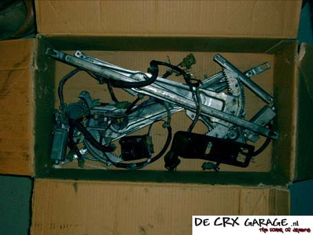  
*The purchased parts.*

### Additional Required Items

I also bought the following additional items:

- Single-pole relay 12 V 40 A + required terminals (new at an electronics store for €15)
- Left cover for switch panel (new at the dealer for €12.39 excl. VAT)
- Caps (2x) for the switch panel cover (new at the dealer for €2.73 excl. VAT)
- 2 fuse holders (new at the electronics store for €2 each)
- 2 x 12-pin universal connectors (new at the electronics store for €2 each)
- 2 x Metal plate to which the switch housing is screwed (second-hand €10)

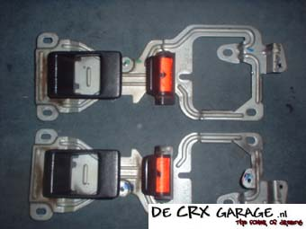  
*The VTEC door mechanisms with extra attachment for the switches.*

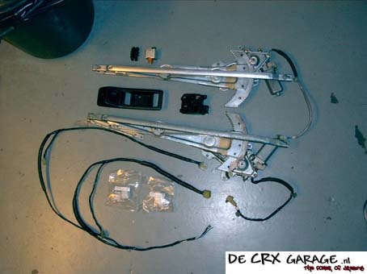  
*The second-hand purchased parts.*

> **Note on Door Panels:** It's also possible to swap the door panels from a VTEC. The downside is that the leather upholstery won't match the rest of the interior. However, you can combine the lower VTEC part with the upper ED9 part. [Click here for the door panel upholstery guide.](https://www.decrxgarage.nl/index.php?option=com_content&view=article&id=50&Itemid=53)

## Installation Process

### 1. Wiring Harness Preparation

- Remove the clips from the wiring harnesses
- Remove the tape from the wiring harnesses
- Remove unnecessary wires

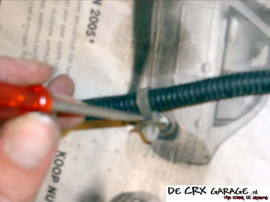  
*The clips can be reused by removing them by pressing the barb with a screwdriver.*

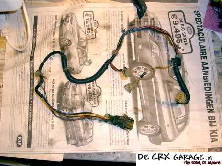  
*The right-side wiring harness in its original state.*

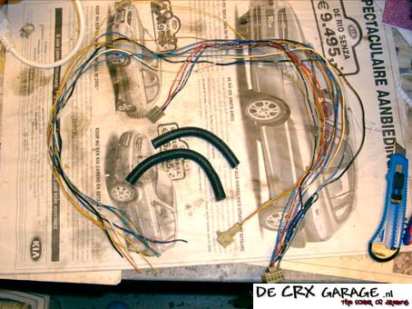  
*The wiring harness without tape and connector.*

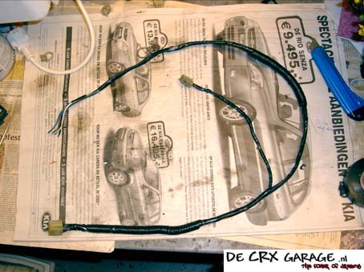  
*The wiring harness as it ended up looking.*

### 2. Relay Installation

- Remove the cover from the fuse box in the car
- Install relay near the fuse box frame using the threaded rod
- Connect wiring according to the electrical diagram below

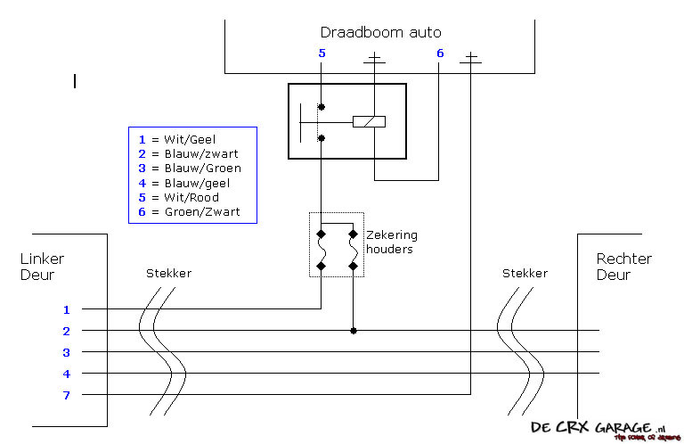

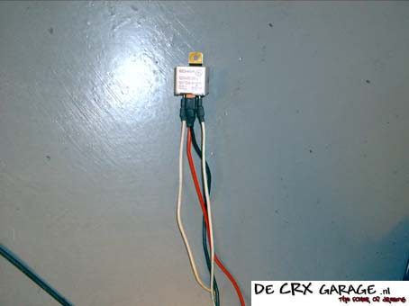  
*The relay with terminals and wires.*

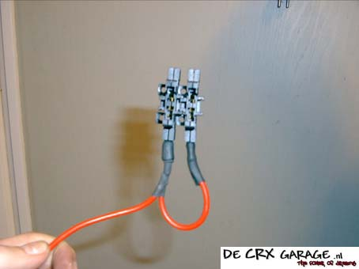  
*The wire to the fuse holders.*

### 3. Door Panel Removal

1. Remove all screws from the door panel
2. Remove door handle cover
3. Remove speaker panel
4. Remove screws under speaker panel
5. Remove window crank
6. Detach door panel

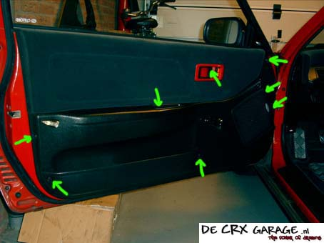  
*The door panel screws are indicated with green arrows.*

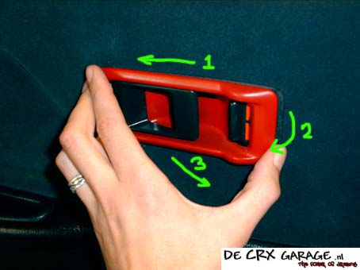  
*3-step plan to remove the cover.*

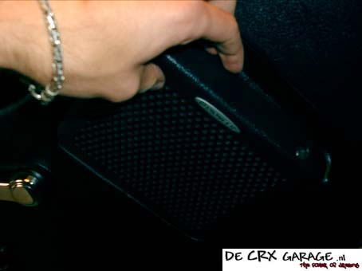  
*Removing the speaker panel.*

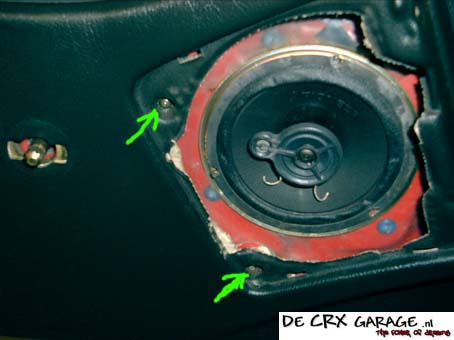  
*The screws behind the speaker panel.*

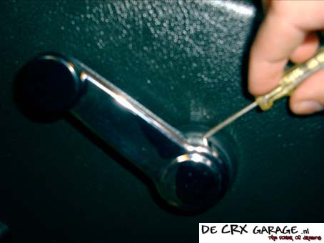
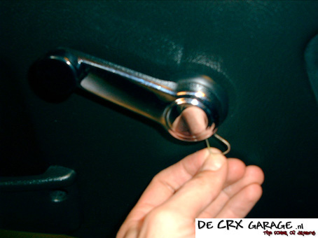  
*Removing the window crank.*

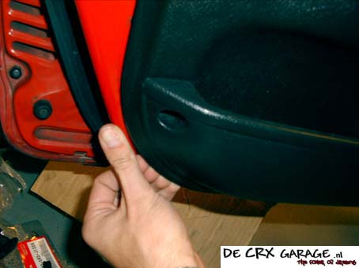  
*Pulling the door panel off the clips.*

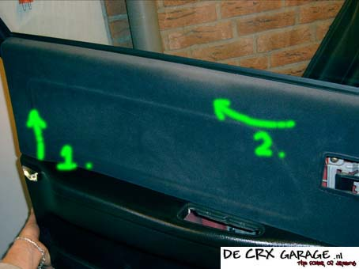  
*Detaching the door panel.*

### 4. Window Mechanism Removal

1. Temporarily reattach crank
2. Lower window
3. Remove guide rail bolts
4. Detach window from mechanism
5. Secure window with string

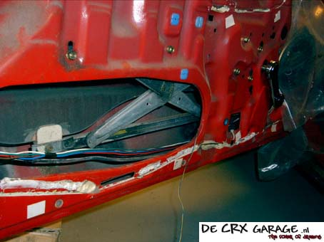  
*Window cranked down.*

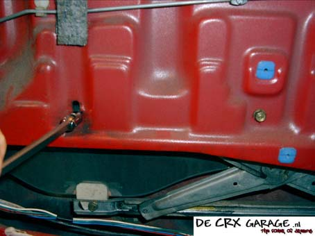  
*The 2 bolts of the short guide rail.*

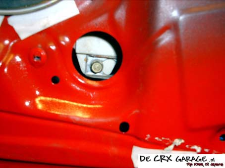  
*The front bolt of the long guide rail.*

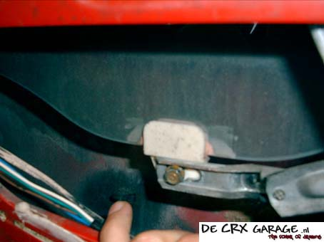  
*The rear bolt of the long guide rail.*

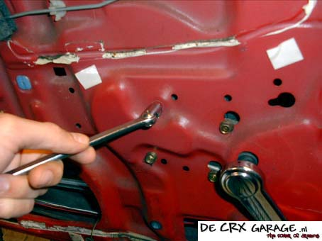  
*The 4 bolts of the mechanism.*

> **Tip for Window Support:** Make a loop in a string and place it around the window's attachment block. Drape it over the frame and tie it at the bottom of the door.

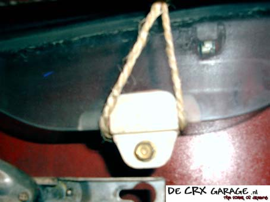  
*The string loop over the attachment block.*

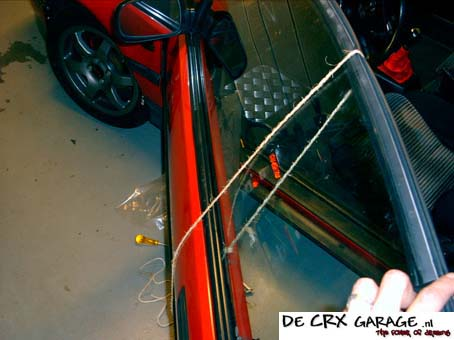  
*The string over the window.*

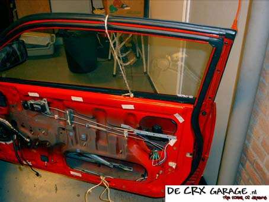  
*And then tied at the bottom of the door.*

### 5. Electric Mechanism Installation

1. Remove old mechanism
2. Remove door stopper pin
3. Install wiring harness
4. Connect electrical components

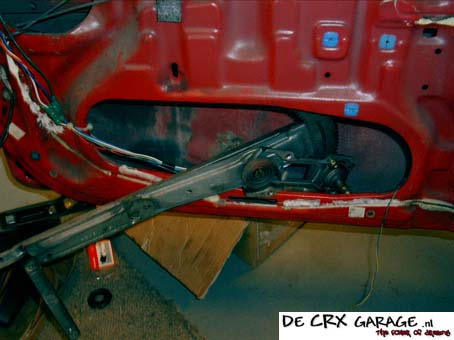  
*Removing the window mechanism from the door.*

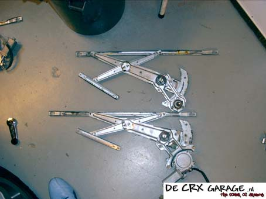  
*See the difference between the manual and electric mechanisms.*

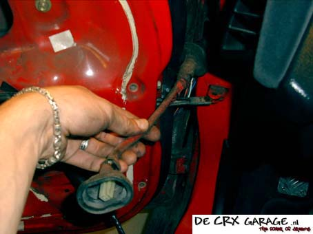  
*The cable passage.*

### 6. Wiring Installation

1. Install wiring harness with clips
2. Connect to fuse box
3. Install connectors
4. Route cables through passages

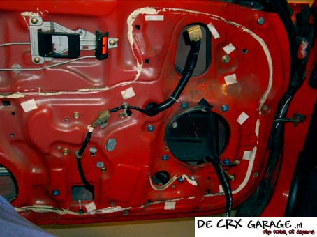  
*The wiring harness in the door.*

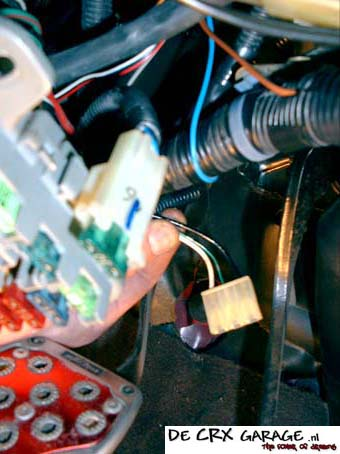  
*The electric roof connector.*

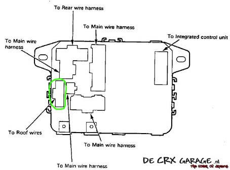  
*The location of the electric roof connector.*

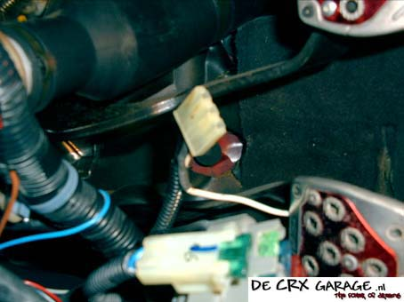  
*The relay wire soldered to the middle (green/black) wire and protected with heat-shrink tubing.*

### 7. Cable Passage Installation

1. Route wires through clamps
2. Wrap with special tape
3. Install connectors

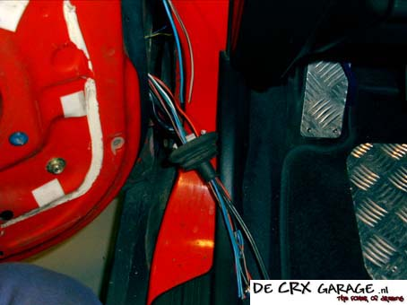  
*The wires through the clamp.*

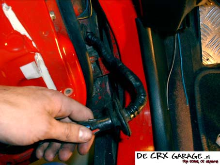  
*The cable passage.*

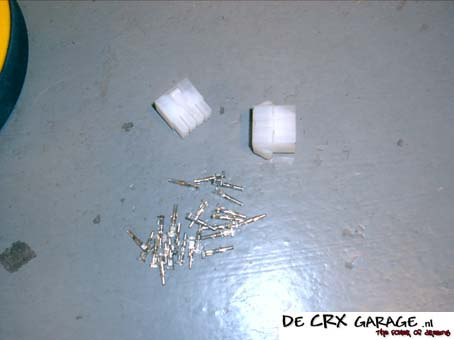  
*The universal connector block.*

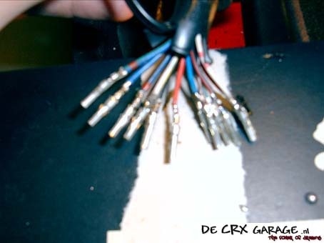  
*The connector pins on the wires.*

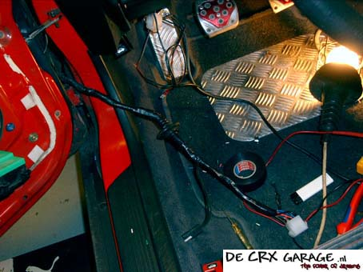  
*The wiring harness with connector.*

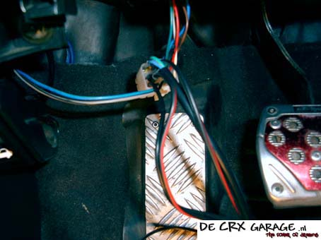  
*The connector on the inside.*

### 8. Final Assembly

1. Test mechanism operation
2. Lubricate if necessary
3. Install mechanisms in doors
4. Adjust window position
5. Install switch panels
6. Reassemble door panels

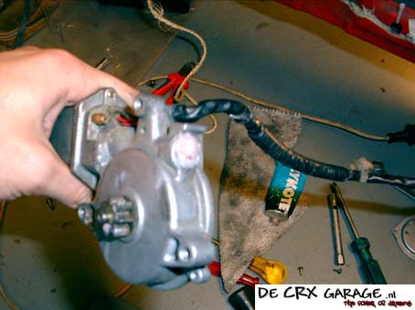  
*Grease sprayed into the worm gear housing opening.*

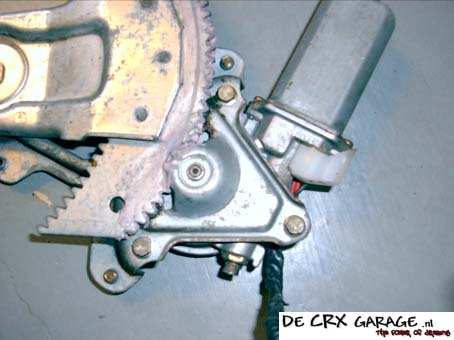  
*Clean grease at the rack.*

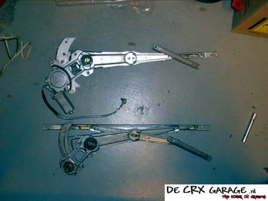  
*The motor position must match the position of the old mechanism as it was removed.*

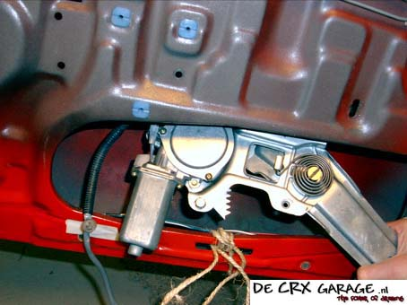  
*Placing the electric mechanism in the door.*

### 9. Switch Panel Installation

1. Modify holes for switch panels
2. Install switches
3. Final assembly

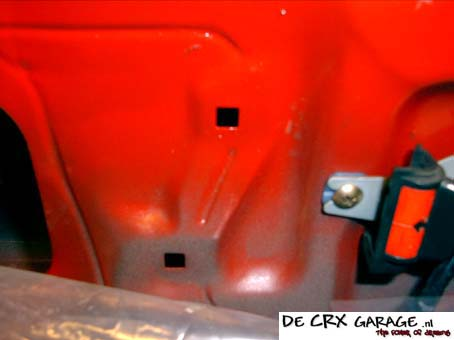  
*The holes where the extra plugs need to go.*

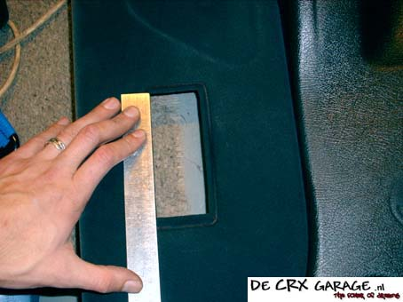  
*The hole as it was.*

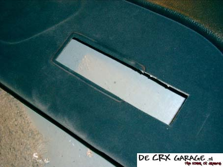  
*The enlarged hole on the passenger side.*

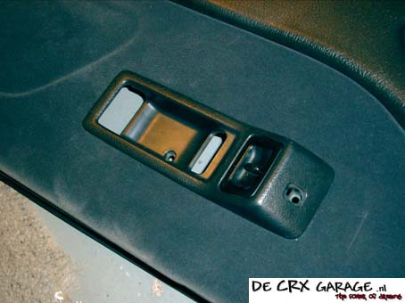  
*The cover with switches attached for fitting.*

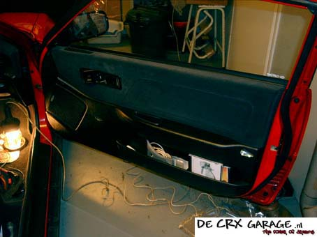  
*The right door panel.*

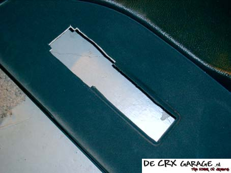  
*The hole for the driver's side switches.*

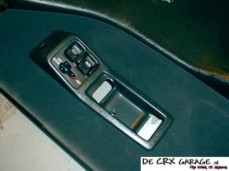  
*Switch on the driver's side.*

  
*The panel on the driver's side.*
